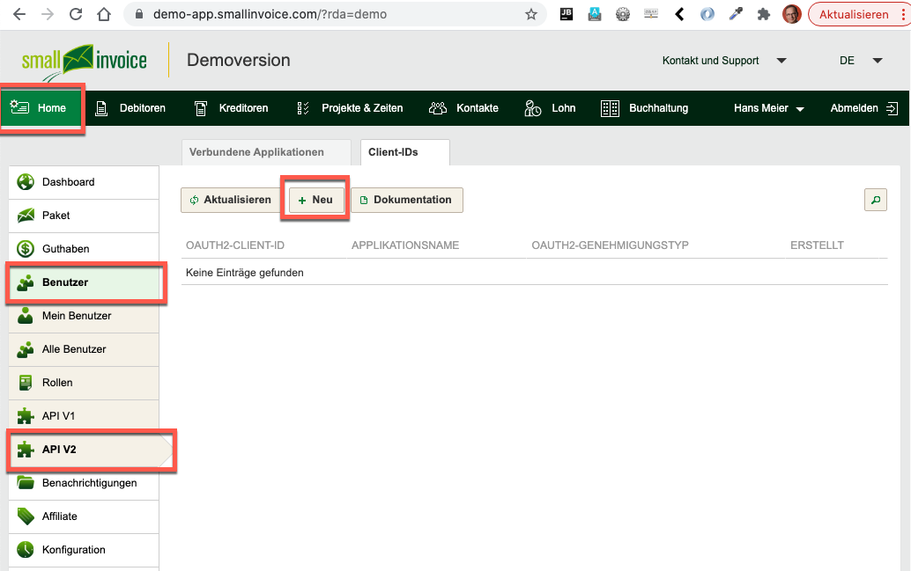
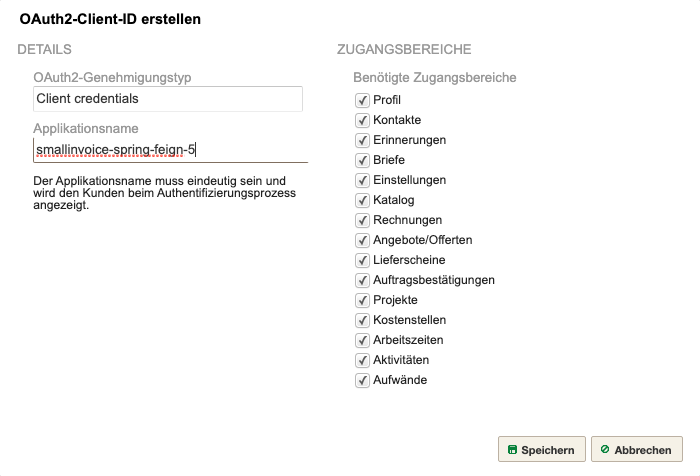
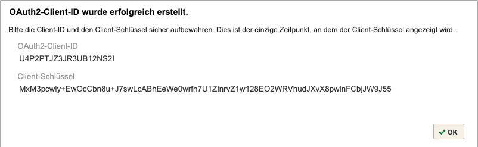

# Small Invoice API Component for Java

[https://github.com/mbachmann/smallinvoice-api-parent](https://github.com/mbachmann/smallinvoice-api-parent)

The `smallinvoice-spring-feign` component provides access to the _smallinvoice_ `REST API V2`.
It contains the _login-api_, the [api](smallinvoice-spring-feign/src/main/java/com/example/smallinvoicespringfeign/api)
to the published end points and all [models](smallinvoice-spring-feign/src/main/java/com/example/smallinvoicespringfeign/model).
The [configuration](smallinvoice-spring-feign/src/main/java/com/example/smallinvoicespringfeign/configuration/ClientConfiguration.java)
supports retry in case of certain errors.

This is a _multi maven project_.

- The **api component** can be found [smallinvoice-spring-feign maven project](smallinvoice-spring-feign/README.md).
- The **usage of the component** can be seen in the _integration tests_ of the [smallinvoice-api-test maven project](smallinvoice-api-test/README.md).

The API has been generated through an [open api interface](https://swagger.io/specification/) definition file:[smallinvoice-openapi-specification-2.0.0.yaml](smallinvoice-spring-feign/src/main/resources/smallinvoice-openapi-specification-2.0.0.yaml).
You can copy and paste the file into the [swagger editor](https://editor.swagger.io/).
The [smallinvoice api](https://api.smallinvoice.com/v2/doc/?action=endpoints) has some special date-time formats
(**not** [ISO8601](https://en.wikipedia.org/wiki/ISO_8601) or [RFC3339](https://datatracker.ietf.org/doc/html/rfc3339))
which does not fit the [open api description](https://swagger.io/docs/specification/data-models/data-types/).
The component is _serializing/deserializing_ the _open-api date-time format_ to `LocalDateTime` by using `@JsonFormat(pattern="yyyy-MM-dd HH:mm:ss")`.
The component is not serializing properties with a `null value`.

### Description of the API

Read the instructions at [https://api.smallinvoice.com/v2/doc/?action=introduction](https://api.smallinvoice.com/v2/doc/?action=introduction).

The API itself consists of six different groups:

- Auth
- Catalog
- Configuration
- Contacts
- Receivables
- Reporting

Not all data of small invoice can be accessed through the API.

Please be aware that **the API can be changed by smallinvoice**, which will maybe causing some errors of the integration tests.
In this case the [smallinvoice-openapi-specification-2.0.0.yaml](smallinvoice-spring-feign/src/main/resources/smallinvoice-openapi-specification-2.0.0.yaml)
file has to be adjusted, and the [smallinvoice-spring-feign component](smallinvoice-spring-feign/README.md) regenerated through `mvn clean package`.

### Integration Tests

The integration tests demonstrate on how to use the component with the _smallinvoice api_:

- [AuthTest.java](smallinvoice-api-test/src/test/java/com/example/smallinvoice/springfeign/AuthTest.java)
- [CatalogTest.java](smallinvoice-api-test/src/test/java/com/example/smallinvoice/springfeign/CatalogTest.java)
- [ConfigurationTest.java](smallinvoice-api-test/src/test/java/com/example/smallinvoice/springfeign/ConfigurationTest.java)
- [ContactsTest.java](smallinvoice-api-test/src/test/java/com/example/smallinvoice/springfeign/ContactsTest.java)
- [ReceivablesTest.java](smallinvoice-api-test/src/test/java/com/example/smallinvoice/springfeign/ReceivablesTest.java)
- [ReportingTest.java](smallinvoice-api-test/src/test/java/com/example/smallinvoice/springfeign/ReportingTest.java)

The _integration tests_ show some errors. This is due to some misbehavior of the small invoice api:

- getIsrs(): Deserialization error because of wrong _date-time_ from the API
- getFirstInvoice(): the filter criteria for invoices to a certain contact_id does not work properly.

### Project Setup

The _smallinvoice_ API supports two of four _oauth2 flows_:

- client credentials flow
- authorization flow

The test project is using the `client credentials flow`. In oder to run the _unit test_, the _client credentials_ must be created through the _smallinvoice app_.

There are two different stagings of _smallinvoice_:

- The Demo staging: [https://demo-app.smallinvoice.com/](https://demo-app.smallinvoice.com/)
- The Production staging: [https://app.smallinvoice.com/](https://app.smallinvoice.com/)

The `REST API` is available through the urls:

- [https://demo-api.smallinvoice.com](https://demo-api.smallinvoice.com)
- [https://api.smallinvoice.com](https://api.smallinvoice.com)

### Gathering the Client Id and Credentials

Navigate in _smallinvoice_ to _Home -> User -> API V2_. Click on the _register tab Client-IDs_:

 

 

Fill in the dialog a _unique arbitrary name_, check all _scope checkboxes_ and click and click save.

 

 

The resulting dialog shows the _client-id_ and the _key_.

 

 

Copy the `client-id` and the `key` and fill it into the file
[application-smallinvoice.properties](smallinvoice-api-test/src/main/resources/application-smallinvoice.properties).
Adjust the appropriate staging url `smallinvoice.url`.

The _integration tests_ will run after entering valid _client credentials_.

